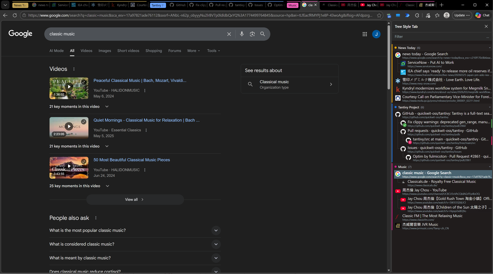
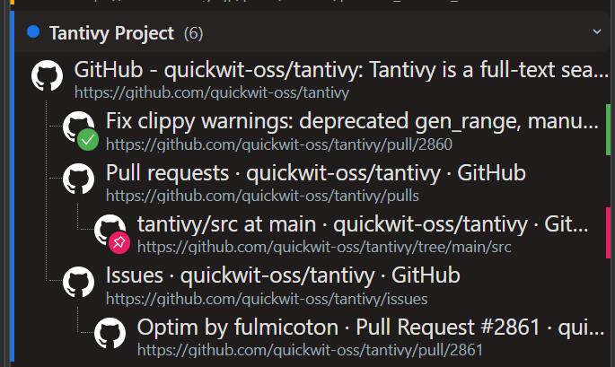
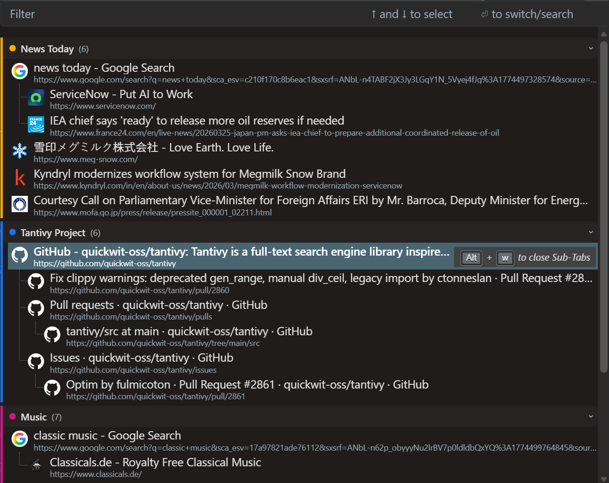
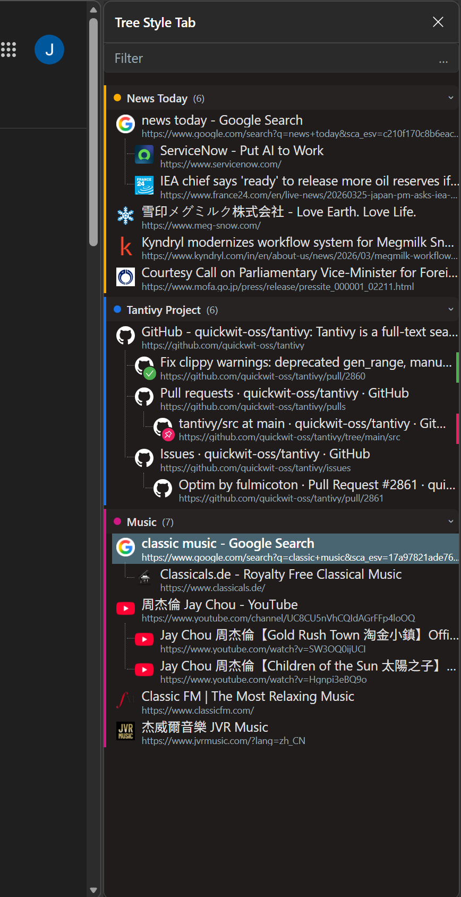
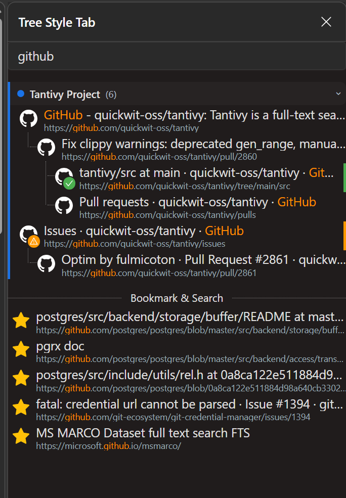
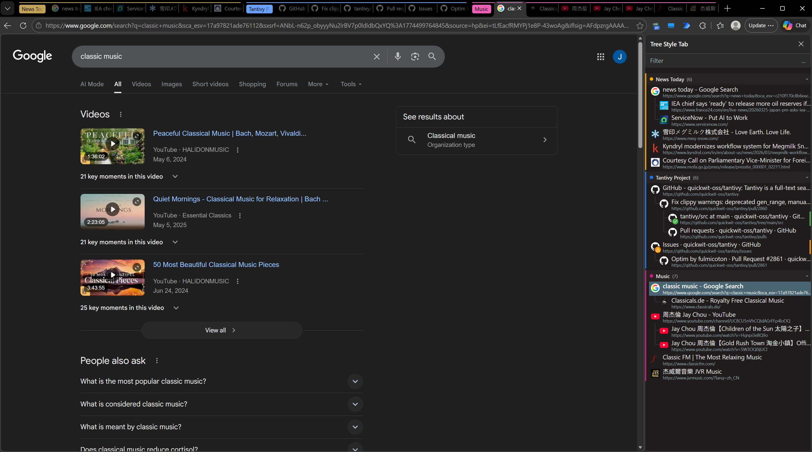
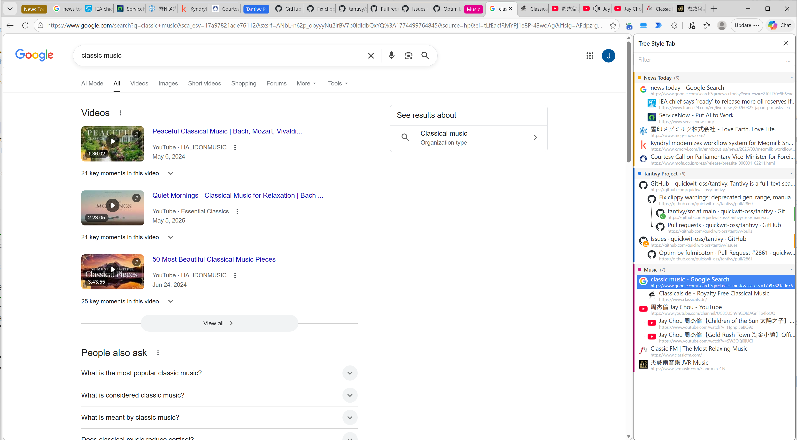

## Tree Style Tab

<p align="center">
  
</p>

<p align="center">
  <strong>A tree-style tab manager for Chrome & Edge</strong><br/>
  Organize, search, and navigate your tabs visually.
</p>

<p align="center">
  <a href="https://chromewebstore.google.com/detail/tree-style-tab/hbohdjmnjcbngeflcopjdnmpoiolkfoc">
    
  </a>
  <a href="https://microsoftedge.microsoft.com/addons/detail/tree-style-tab/jemgfkmpnlaeopgihkaoncnobfnjkjgn">
    
  </a>
  <a href="https://chromewebstore.google.com/detail/tree-style-tab/hbohdjmnjcbngeflcopjdnmpoiolkfoc">
    
  </a>
</p>

<p align="center">
  
</p>

---

### Why Tree Style Tab?

When you have dozens of tabs open, finding the right one is painful. Tree Style Tab solves this by displaying your tabs as a **tree** — tabs opened from the same page are grouped as children, giving you instant context about how your tabs relate to each other.

---

### Features

#### 🌳 Tree View

Tabs are organized into a parent-child tree based on how they were opened. Collapse, expand, and drag & drop to reorganize — even across tab groups.

<p align="center">
  
</p>

#### 📁 Chrome Tab Groups

Full support for native Chrome/Edge tab groups. Color-coded containers, click to collapse/expand (synced with browser), double-click to inline edit name & color.

<p align="center">
  
  &nbsp;&nbsp;
  
</p>

#### 🖥️ Two Modes

| | Popup Mode | Side Panel Mode |
|---|---|---|
| **Shortcut** | `Alt + Q` | `Alt + S` |
| **Style** | Overlay, closes after action | Always visible alongside pages |
| **Best for** | Quick tab switching | Managing many tabs |

<p align="center">
  
  &nbsp;&nbsp;
  
</p>

#### ✋ Drag & Drop

Rearrange tabs by dragging them anywhere in the tree. Move tabs between groups, reorder siblings, or nest as children. A live position indicator shows exactly where the tab will land.

<p align="center">
  
</p>

#### 🏷️ Tab Marks (Side Panel)

In side panel mode, hover a tab to reveal quick-action buttons. Mark tabs with icons (✓ Done, 📌 Pin, ✗ Reject, ⚠ WIP, ? Question) — the mark shows as a colored badge on the favicon for easy visual scanning.

<p align="center">
  
</p>

#### 🔍 Search

Type to filter tabs by title or URL instantly. Bookmarks also appear in results. No match? Press Enter to search Google directly.

<p align="center">
  
</p>

#### ⌨️ Keyboard Shortcuts

| Key | Action |
|---|---|
| `↑` `↓` | Move between tabs |
| `←` | Collapse / Go to parent |
| `→` | Expand / Go to first child |
| `Enter` | Switch to selected tab |
| `Alt + W` | Close tab and all its children |
| `Alt + Q` | Open popup |
| `Alt + S` | Open side panel |

#### 🎨 Themes

Automatic dark / light mode based on your system preference.

<p align="center">
  
  &nbsp;&nbsp;
  
</p>

---

### Getting Started

1. Install from [Chrome Web Store](https://chromewebstore.google.com/detail/tree-style-tab/hbohdjmnjcbngeflcopjdnmpoiolkfoc) or [Edge Add-ons](https://microsoftedge.microsoft.com/addons/detail/tree-style-tab/jemgfkmpnlaeopgihkaoncnobfnjkjgn)
2. Pin the extension for quick access
3. Press `Alt + Q` (popup) or `Alt + S` (side panel) to start

### Development

```bash
npm install
npm run start:dev    # Dev server with mock data (localhost:3000)
npm run build        # Production build
```

Dev mode includes a **popup / sidepanel toggle** in the bottom-left corner. In sidepanel mode, a resizable drag handle lets you simulate different panel widths.

### Note
Tabs opened before installing the extension will appear as a flat list — the tree structure only tracks tabs opened after installation.