## Tree Style Tab

<p align="center">
  
</p>

<p align="center">
  <strong>A tree-style tab manager for Chrome & Edge</strong><br/>
  Organize, search, and navigate your tabs visually.
</p>

<p align="center">
  <a href="https://chromewebstore.google.com/detail/tree-style-tab/oicakdoenlelpjnkoljnaakdofplkgnd">
    
  </a>
  <a href="https://microsoftedge.microsoft.com/addons/detail/tree-style-tab/gebppppmdlmbaigelgpdlpfkaodikfon">
    
  </a>
  <a href="https://chromewebstore.google.com/detail/tree-style-tab/oicakdoenlelpjnkoljnaakdofplkgnd">
    
  </a>
</p>

<p align="center">
  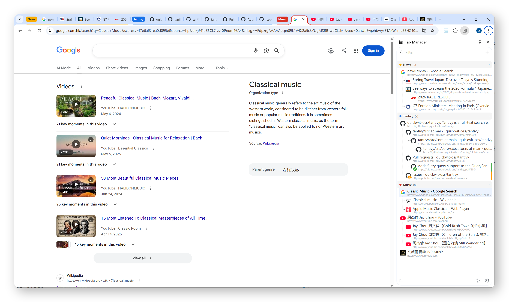
</p>

---

### Why Tree Style Tab?

When you have dozens of tabs open, finding the right one is painful. Tree Style Tab solves this by displaying your tabs as a **tree** — tabs opened from the same page are grouped as children, giving you instant context about how your tabs relate to each other.

---

### Features

#### 🖥️ Two Modes

| | Popup Mode | Side Panel Mode |
|---|---|---|
| **Shortcut** | `Alt + Q` | `Alt + S` |
| **Style** | Overlay, closes after action | Always visible alongside pages |
| **Best for** | Quick tab switching | Managing many tabs |

<p align="center">
  
</p>
<p align="center">
  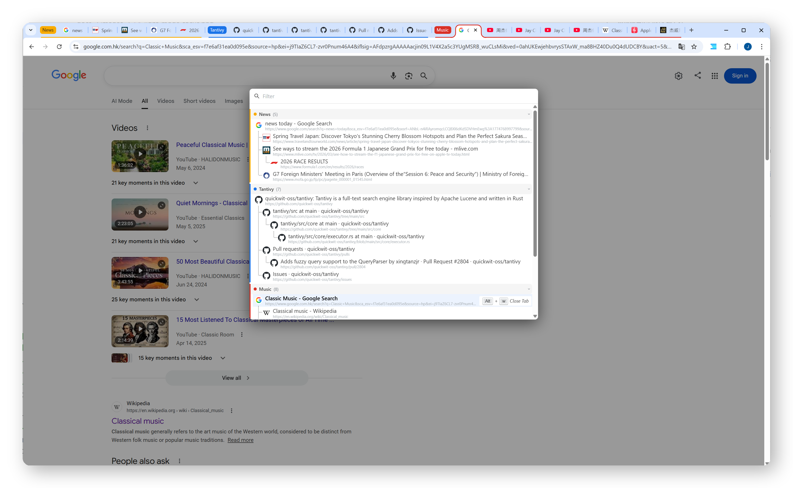
</p>

#### 🌳 Tree View

Tabs are automatically organized into a parent-child tree based on how they were opened. Collapse and expand subtrees (with a +N badge showing hidden children count), or drag & drop to reorganize — even across tab groups. The tree updates in real time as you open, close, or move tabs.

<p align="center">
  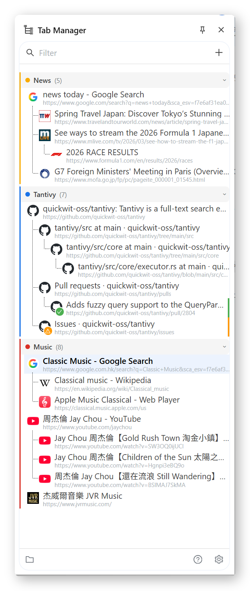
  &nbsp;&nbsp;
  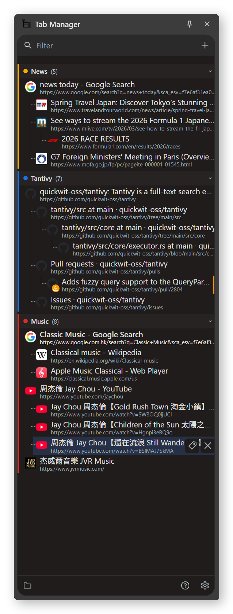
</p>

#### 📁 Chrome Tab Groups

Full support for native Chrome/Edge tab groups. Color-coded containers with 9 colors, click to collapse/expand (bi-directionally synced with the browser), and double-click the group header to inline edit name & color. Tabs dragged between groups are automatically reassigned.

<p align="center">
  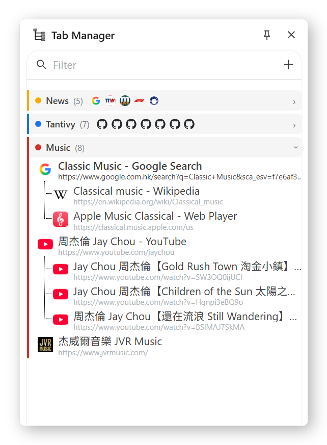
  &nbsp;&nbsp;
  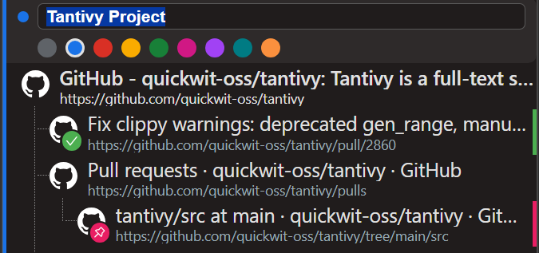
</p>


#### ✋ Drag & Drop

Rearrange tabs by dragging them anywhere in the tree. Move tabs between groups, reorder siblings, or nest as children. A live position indicator shows exactly where the tab will land. Dragging a tab moves its entire subtree.

#### 🏷️ Tab Marks (Side Panel)

In side panel mode, hover a tab to reveal quick-action buttons. Mark tabs with icons (✓ Done, 📌 Pin, ✗ Reject, ⚠ WIP, ? Question) — the mark shows as a colored badge on the favicon for easy visual scanning. Marks are preserved when saving workspaces.

<p align="center">
  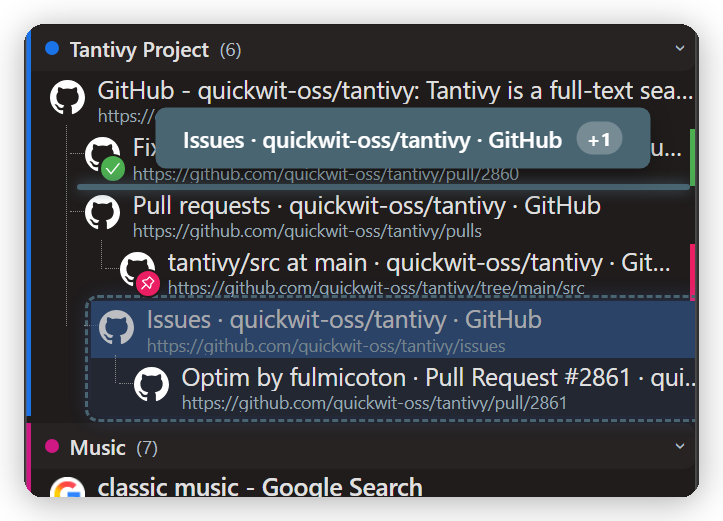
  &nbsp;&nbsp;
  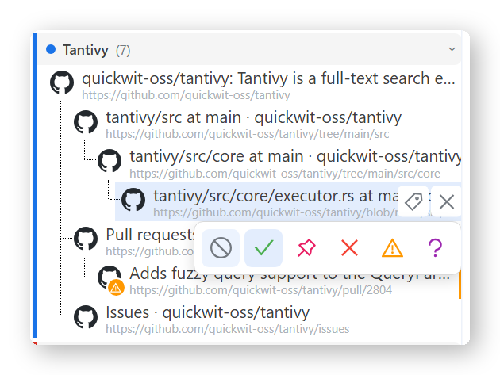
</p>

#### 🔍 Search & Filter

Type to filter tabs by title or URL instantly with keyword highlighting. Bookmarks also appear in results (up to 30 matches). No match? Press Enter to search Google directly. Full IME composition support for CJK input.

<p align="center">
  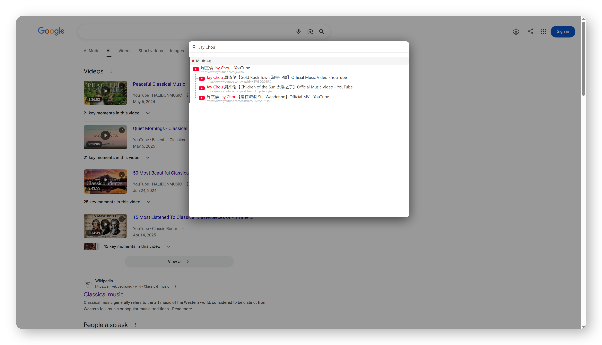
</p>

#### 📂 Workspaces (Side Panel)

Save your current window as a named workspace — all tabs, tree structure, groups, and marks are preserved. Reopen a workspace later to restore everything. Preview and edit saved workspaces: rename, remove tabs, reorganize with drag & drop, or modify groups and marks before restoring.

<p align="center">
  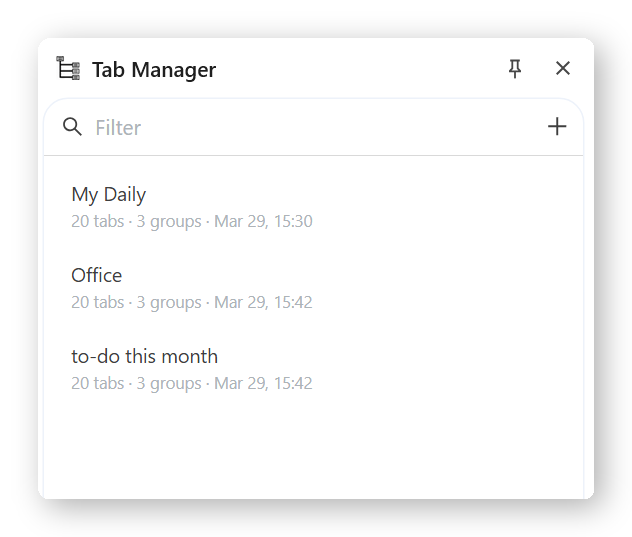
</p>

#### ⌨️ Keyboard Shortcuts

| Key | Action |
|---|---|
| `↑` `↓` | Move between tabs |
| `←` | Collapse / Go to parent |
| `→` | Expand / Go to first child |
| `Enter` | Switch to selected tab |
| `Alt + W` | Close tab and all its children |
| `Alt + Q` | Open popup |
| `Alt + S` | Open side panel |

Start typing anywhere to instantly filter — the search field auto-focuses.

#### 🎨 Themes

Automatic dark / light mode based on your system preference.

<p align="center">
  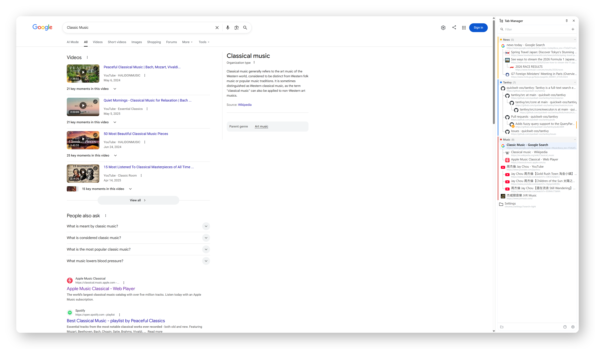
  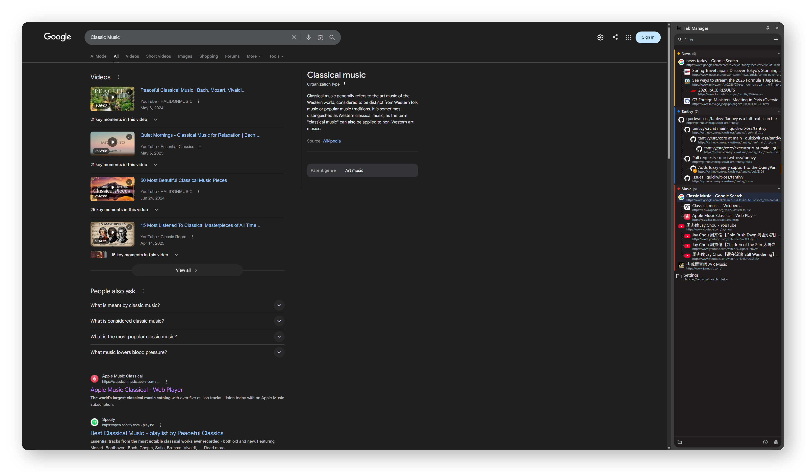
</p>

#### 🌐 Internationalization

Supports 10 languages out of the box: English, German, Spanish, French, Japanese, Korean, Portuguese (Brazil), Russian, Simplified Chinese, and Traditional Chinese.

---

### Getting Started

1. Install from [Chrome Web Store](https://chromewebstore.google.com/detail/tree-style-tab/oicakdoenlelpjnkoljnaakdofplkgnd) or [Edge Add-ons](https://microsoftedge.microsoft.com/addons/detail/tree-style-tab/gebppppmdlmbaigelgpdlpfkaodikfon)
2. Pin the extension for quick access
3. Press `Alt + Q` (popup) or `Alt + S` (side panel) to start
4. A guided onboarding tour will walk you through key features on first install

### Development

```bash
npm install
npm run start:dev    # Dev server with mock data (localhost:3000)
npm run build        # Production build
```

Dev mode includes a **popup / sidepanel toggle** in the bottom-left corner. In sidepanel mode, a resizable drag handle lets you simulate different panel widths.

### Note
Tabs opened before installing the extension will appear as a flat list — the tree structure only tracks tabs opened after installation.
